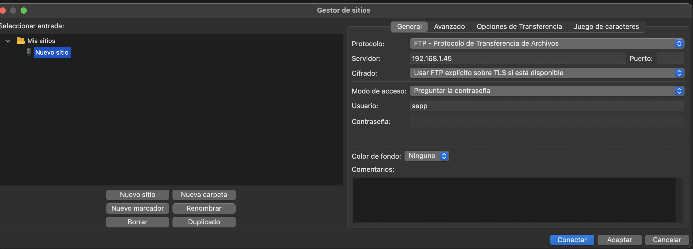
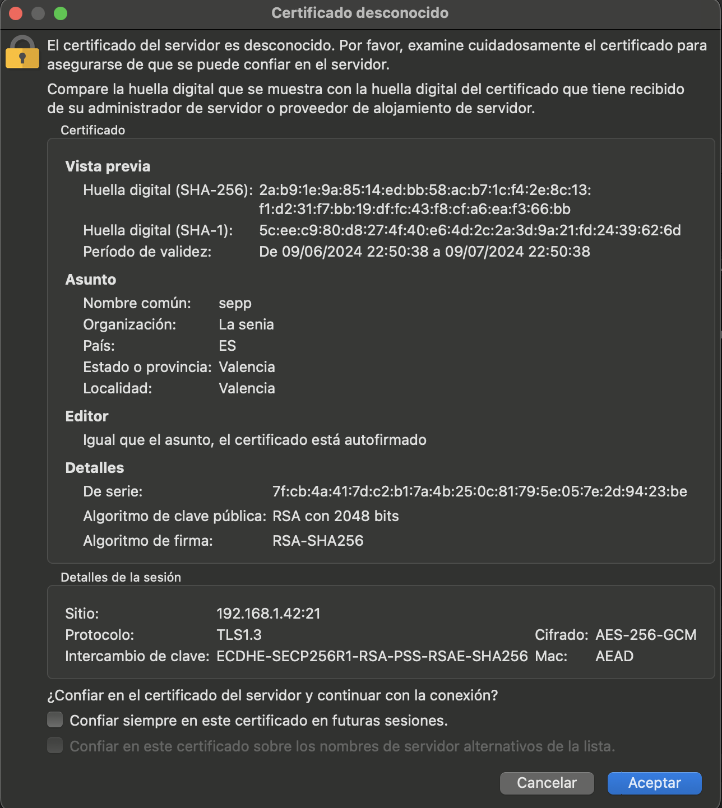
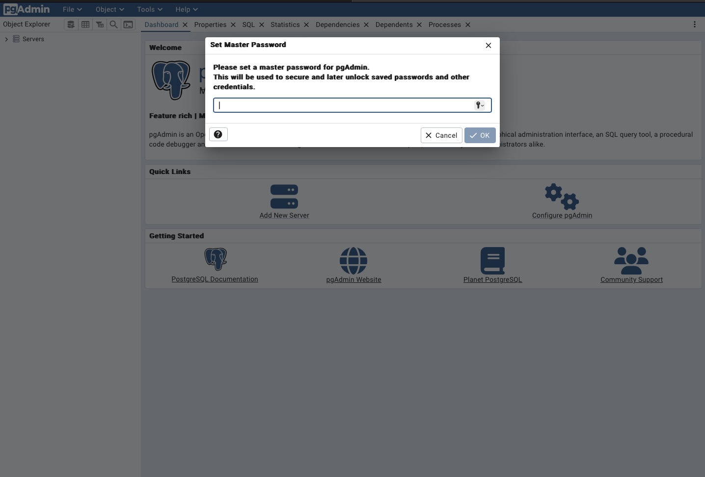
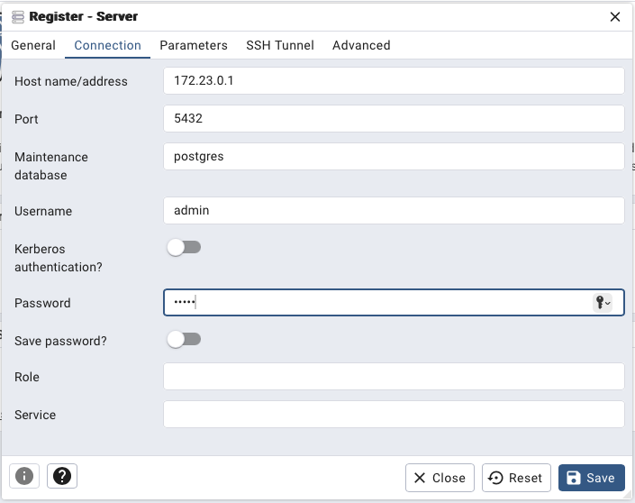
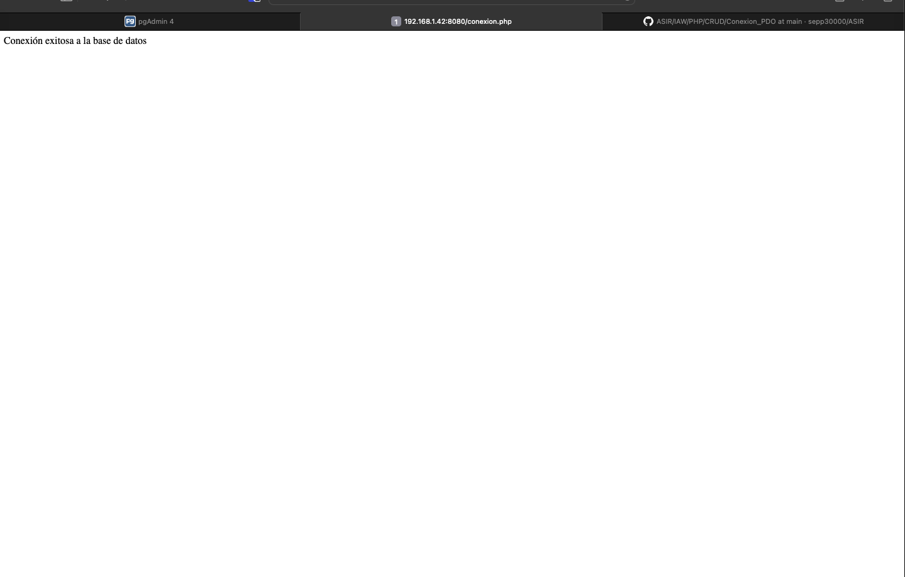
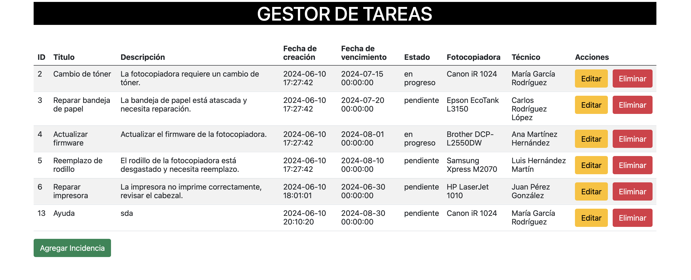
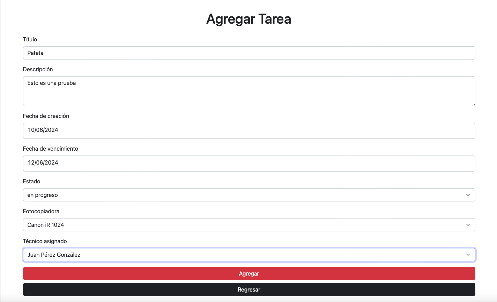
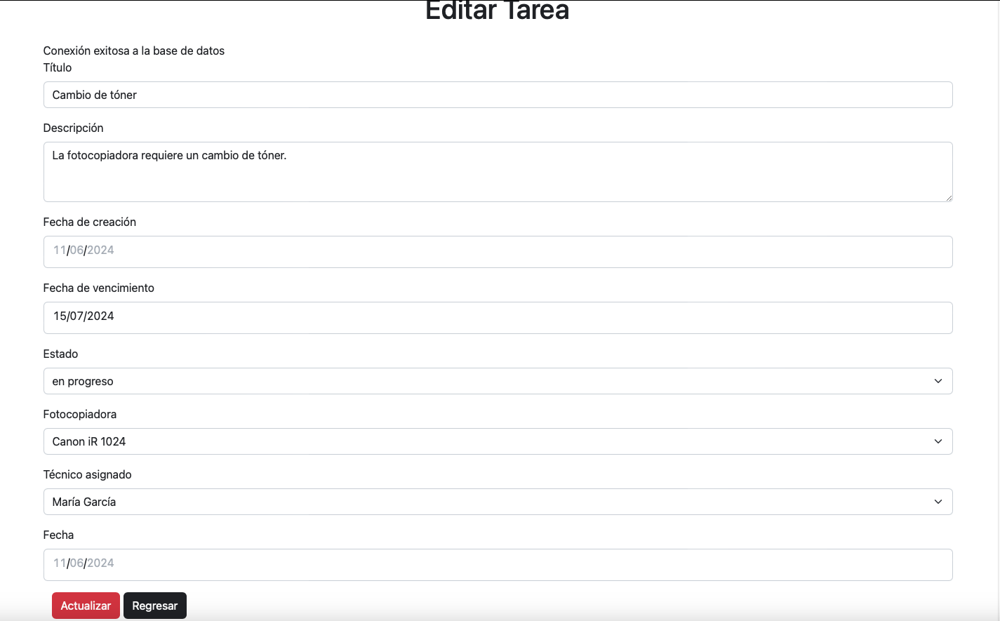

# Proyecto Final de CFGS de José Ramón Peris Murcia 2º ASIR
<br>
<br>
<br>
<br>
<br>
<br>
<br>
<br>
<br>
<br>


<br>
<br>
<br>
<br>
<br>
<br>
<br>
<br>

<center>José Ramón Peris</center>
<center>Fecha: 11-06-2024</center>

---

## Indice
1. [Introducción](#Introducción)
2. [¿Qué es lo que busca el cliente?](#que-es-lo-que-nos-pide-el-cliente)
4. [Presupuesto del proyecto](#presupuesto-del-proyecto)
5. [Montaje de la infraestructura de red](#montaje-de-la-infraestructura-de-red)    
    1. [Configuración de la red](#configuración-de-la-red)
    2. [Configuración de los routers](#configuración-de-los-routers)
    3. [VPN](#VPN)
6. [Sistemas de almacenamiento](#sistemas-de-almacenamiento)
    1. [Instalación de Docker](#instalación-de-docker)
    2. [WebDAV](#webdav)
    3. [FTP](#ftp)
1. [CRUD en PostgreSQl](#crud-en-postgresql)
    1. [Creación de la BBDD](#creación-de-la-bbdd)
    1. [Programación en PHP](#programación-en-php)
<br>

## Introducción

En este proyecto se va a realizar la infraestructura de una empresa, en este caso será una empresa encargada de suministros escolares, material de oficina y reprografía (Gestión y reparación de máquinas fotocopiadoras).

Para ello nos guiarse en los planos de la nave donde se encuentra la empresa y buscaremos **la mejor opción posible para realizar nuestro proyecto**.


Como se ve en el plano de generado en GNS3 nos encontramos con una nave de **dos plantas**. En la primera planta nos encontramos con toda la parte del **almacen** donde se aloján los suministros escolares. El **departamento de técnicos de las máquinas fotocopiadoras**, donde se encargarán de la reparación y configuración de las máquinas fotocopiadoras y la zona donde ubicaremos la **DMZ**.

En la primera planta se ubicará **el departamento de admininstración y finanzas**.

## ¿Que es lo que nos pide el cliente?

*El cliente busca que realicemos una actualización de su infraestructura de red y una digitalización del almacen, de la zona de técnicos y administración.*

Para ello se le planteará las siguientes propuestas:

- Levantar una infraestructura de red mediante la configuración de routers Mikrotik que realizará la salida de internet, firewall y portforwarding.

- La implantación de una aplicación de tareas para que los técnicos puedan realizar un seguimiento de las máquinas desde que entran al taller hasta que salen del mismo.

- Desarrollo de una solución de almacenamiento de datos que permita la no dependencia de servicios de nube como Dropbox o Google Drive.

- La construcción de una DMZ que permita tener dos servidores encargados de los servicios implementados

- La implantación de una VPN que permita acceder a estos servicios.

La empresa acepta la propuesta y da por comenzar el proyecto

## Presupuesto del proyecto

Después del estudio que hemos realizado en la nave, se encuentran con que el *tema de infraestructura de cableado a sido montada con anterioridad al tratarse de una nave moderna.* Por lo tanto se presupuesta tanto los equipos nuevos, la DMZ, y el tratamiento de switches, routers, etc.

Aquí nos encontramos con el presupuesto que le hemos realizado a la empresa con todos sus enlaces en la web de **PcComponentes**:

| Modelo | Cantidad | Precio Unidad | Enlace |
|:------:|:--------:|:-------------:|------|
| Armario Rack 19" 22U 600x600 (Para DMZ) |  1 |   413,67€   |[Comprar](https://www.pccomponentes.com/armario-rack-19-22u-600x600?utm_source=531573&utm_medium=afi&utm_campaign=shopforward.nl&sv1=affiliate&sv_campaign_id=531573&awc=20982_1716742105_4386269844ea01d5a9218daa611daf51&utm_term=deeplink&utm_content=25082.Cj0KCQjwu8uyBhC6ARIsAKwBGpSQPnuLyLwCtWH3D-_6RvKMMFQPTFny4pVcGFAZUzhE5W9CqmC1W5AaAsp_EALw_wcB)|
| VidaXL Armario Rack 19" 12U 600x640mm (Para administración) | 1   | 148,98€  |[Comprar](https://www.pccomponentes.com/vidaxl-armario-rack-19-12u-600x640mm?utm_source=531573&utm_medium=afi&utm_campaign=shopforward.nl&sv1=affiliate&sv_campaign_id=531573&awc=20982_1716742054_91b2a72c9893094b43aeeccc211d676d&utm_term=deeplink&utm_content=25082.Cj0KCQjwu8uyBhC6ARIsAKwBGpRdj6UrKEbh_rgSWqzv1DDvmSA3wRlq9MszeB_RlaJcYq-nWxEXADwaAqzTEALw_wcB)|
| VidaXL Armario Rack 19" 6U 600x450x375mm  | 3   | 96,99€ |[Comprar](https://www.pccomponentes.com/vidaxl-armario-rack-19-6u-600x450x375mm?utm_source=531573&utm_medium=afi&utm_campaign=shopforward.nl&sv1=affiliate&sv_campaign_id=531573&awc=20982_1716742063_d5438b74e1ac4e3cba6a08ad1bab3d2c&utm_term=deeplink&utm_content=27932.Cj0KCQjwu8uyBhC6ARIsAKwBGpR11uxnDf4huC_xA1SgIRFAKPqfaK_BeLPBwxaF_hS2rL4J5qdqCeMaAgmyEALw_wcB)|
|Mikrotik RB1100AHx4 Router Ethernet 13 Puertos RJ45 Gigabit PoE | 2 | 314,39€ |[Comprar](https://www.pccomponentes.com/mikrotik-rb1100ahx4-router-ethernet-13-puertos-rj45-gigabit-poe)|
| TP-Link TL-SG1024DE Switch 24 Puertos Gigabit | 5 | 107,43€ |[Comprar](https://www.pccomponentes.com/tp-link-tl-sg1024de-switch-24-puertos-gigabit?utm_source=531573&utm_medium=afi&utm_campaign=shopforward.nl&sv1=affiliate&sv_campaign_id=531573&awc=20982_1716742507_4e25f87295e75b24d972fe659c5435b5&utm_term=deeplink&utm_content=11894.Cj0KCQjwu8uyBhC6ARIsAKwBGpQNMki_9xVS9lmNUM4YVDgASzJW0sPfgHJ1tzq1_vXMTUv00pNjXpsaAmmBEALw_wcB)|
| Equip 326424 Patch panel 24 Puertos Cat 6 | 5 | 79,65€ |[Comprar](https://www.pccomponentes.com/equip-326424-panel-de-parcheo-24-puertos-cat-6)|
| Dell PowerEdge R350 Intel Xeon E-2314/16GB/600GB  | 3 | 1699,00€ | [Comprar](https://www.pccomponentes.com/dell-poweredge-r350-intel-xeon-e-2314-16gb-600gb?utm_source=531573&utm_medium=afi&utm_campaign=shopforward.nl&sv1=affiliate&sv_campaign_id=531573&awc=20982_1716742606_5a39c8a66215f2a7a5db017c7dcee381&utm_term=deeplink&utm_content=717.Cj0KCQjwu8uyBhC6ARIsAKwBGpQMeBHuC80RNCs4UzuRrZbxDQ-PsbGrZ2maCkwp8ppcUHiTgIGlu1oaAhuMEALw_wcB)|
| HP Pavilion All-in-One 27-ca2008ns Intel Core i5-13400T/16GB/512GB SSD/27" (Equipos de trabajo) | 7 | 899,01€ |[Comprar](https://www.pccomponentes.com/hp-pavilion-all-in-one-27-ca2008ns-intel-core-i5-13400t-16gb-512gb-ssd-27?s_kwcid=AL!14405!3!!!!x!!&gad_source=1&gclid=Cj0KCQjwu8uyBhC6ARIsAKwBGpQvVMRSji4wCRDVypftl-USqlGeUqZLbilSEix2VwgitTBOOjG1aFwaAnOwEALw_wcB)|
|Dell Vostro 3520 Intel Core i5-1235U/16GB/512GB SSD/15.6" (Portatiles de backup)|3|639,00€ |[Comprar](https://www.pccomponentes.com/dell-vostro-3520-intel-core-i5-1235u-16gb-512gb-ssd-156?utm_source=624709&utm_medium=afi&utm_campaign=www.twenga-solutions.com&sv1=affiliate&sv_campaign_id=624709&awc=20981_1716742876_68a3fdd1d2d05c9f5a7d5f14ed57f07d&utm_term=deeplink&utm_content=ac5f26529b84508e0911daf7189909c5)|
|-|-|-|-|
|-|-|**Total: 15872,87€ IVA Incuido**|-|

## Montaje de la infraestructura de red

El primer paso a realizar es el montaje de la infraestructura de la red. Este consistirá en los siguientes puntos:

- El montaje de un sistema de routers **Mikrotik** que se encargue del *enrutamiento de la infraestructura de la empresa.*

- Implantación de un servicio de **DNSMasq** responsable de *la asignación de los dns y el dhcp.*

- Configuración del **portforwarding** de los routers, buscando *una mayor seguridad y la redirección de los servicios a nuestra DMZ.*

- Compra y preparación de equipos para almacen, técnicos así como administración y dmz.


### Configuración de la red

Ahora toca la configuración de la red. En este caso se realizará la configuración con unos routers de la marca **Mikrotik** que utilizan el sistema operativo *Router OS* que permite una gran configuración y personalización.

Para ello se realiza la configuración de los **2 routers** que se han comprado.

- Uno será el router de entrada/salida de internet.

- El otro será un router será el encargado de separar a la  **DMZ** del resto de equipos. Haciendo una separación clara entre ellas.

A parte de todo esto, se creará diferentes VLANs que aportará una mayor seguridad, eficiencia y mejor gestión de las redes.

### Configuración de los routers

Para configurar los routers se dividirá en dos partes:

- Configuración de la **red interna de la empresa**, en la que entrará todo el apartado de las *VLAN* y la salida a internet de los equipos.

- Configuración de la **DMZ**, donde se alojará los servidores y comprende el apartado de comuncicación entre los dos routers y la redirección de puertos.

#### Creación de las VLANs

Cada departamento de la empresa va a tener su propia red:

| Nombre | Dirección | Mascara | 
|:------:|:--------:|:-------------:|
|Administración y finanzas|192.168.23.0|24|
|Técnicos|192.168.22.0|24|
|Almacen|192.168.21.0|24|

Para ello se hará uso de las VLANs. Esto permite crear redes lógicas independientes dentro de la misma red física.

Todo esto se realizará en el Router-Entrada. La conexión entre routers será para más adelante. Para crear las VLANs lo primero será la configuración de los switches.

| Nombre | Configuración |
|:------:|:--------:|
|Switch Técnicos||
|Switch Administración||
|Switch Almacen||
|Switch Enlace||


Ahora en el router se crean las VLANs

```bash
/interface/vlan
add name=tecnicos vlan-id=10 interface=ether3 
add name=almacen vlan-id=20 interface=ether3 
add name=administracion vlan-id=30 interface=ether3
```


Y las interfaces de red

```bash
/ip/address
add address=192.168.21.1/24 interface=tecnicos  
add address=192.168.22.1/24 interface=almacen    
add address=192.168.23.1/24 interface=administracion 
```


Después de esto, los equipos pueden tener ip fija o que un servidor dhcp les asigne una dirección ip. Mikrotik dispone de uno y su configuración es:(Solo se enseña la de uno, el resto es igual)

```bash
/ip/dhcp-server
setup

Select interface to run DHCP server on 

dhcp server interface:  
administracion     almacen     ether1     ether2     ether3     ether4     ether5     ether6     ether7     ether8     tecnicos   
dhcp server interface: tecnicos 
Select network for DHCP addresses 

dhcp address space: 192.168.21.0/24  
Select gateway for given network 

gateway for dhcp network: 192.168.21.1 
Select pool of ip addresses given out by DHCP server 

addresses to give out: 192.168.21.2-192.168.21.254, 
Select DNS servers 

dns servers: 8.8.8.8,1.1.1.1            
Select lease time 

lease time: 1800 
```


Finalmente se configura para que todas las interfaces internas salgan por la que está conectada a internet(**ether1**).

```bash
/ip/firewall/nat
add action=masquerade chain=srcnat out-interface=ether1 
```

#### Conexión entre routers

Ahora que está creada la red interna, el siguiente objetivo la conexión entre el **router-salida** y **router-DMZ**.

En router-entrada se crea interfaz que conecte con DMZ

```bash
/ip/address
add address=192.168.10.1/24 interface=ether2
```

En router-DMZ se crea la interfaz que conecte con entrada

```bash
/ip/address
add address=192.168.10.2/24 interface=ether1
```

La salida a internet de manera similar a entrada,además de crear la red interna de la DMZ

```bash
/ip/firewall/nat/
add action=masquerade chain=srcnat out-interface=ether1
/ip/address
add address=192.168.11.1/24 interface=ether2
```

Y la puerta de enlace entre los routers más los dns

```bash
/ip/route
add gateway=192.168.10.1
/ip/dns
set servers=8.8.8.8,1.1.1.1
```

#### Port-Forwarding

Ahora que los routers se comunican, llega el momento de la redirección de puertos. El objetivo es que desde fuera de la red interna no se pueda acceder a la DMZ. Por lo tanto, el **Port-forwarding** es una gran opción.

```bash
# 192.168.21.1
/ip/firewall/nat
# WebDAV
add chain=dstnat dst-address=192.168.21.1 protocol=tcp dst-port=80 action=dst-nat to-addresses=192.168.10.2 to-ports=80
add chain=dstnat dst-address=192.168.21.1 protocol=tcp dst-port=443 action=dst-nat to-addresses=192.168.10.2 to-ports=443
# Postgre
add chain=dstnat dst-address=192.168.21.1 protocol=tcp dst-port=5432 action=dst-nat to-addresses=192.168.10.2 to-ports=5432
# FTP
add chain=dstnat dst-address=192.168.21.1 protocol=tcp dst-port=21 action=dst-nat to-addresses=192.168.10.2 to-ports=21
# Puertos dinamicos
add chain=dstnat dst-address=192.168.21.1 protocol=tcp dst-port=30000-31000 action=dst-nat to-addresses=192.168.10.2 to-ports=30000-31000
# Teamvierwer
add chain=dstnat dst-address=192.168.21.1 protocol=tcp dst-port=5938 action=dst-nat to-addresses=192.168.10.2 to-ports=5938
# ssh
add chain=dstnat dst-address=192.168.21.1 protocol=tcp dst-port=22 action=dst-nat to-addresses=192.168.10.2 to-ports=22
# Pgadmin
add chain=dstnat dst-address=192.168.21.1 protocol=tcp dst-port=5938 action=dst-nat to-addresses=192.168.10.2 to-ports=5050
# PHP-Apache
add chain=dstnat dst-address=192.168.21.1 protocol=tcp dst-port=5938 action=dst-nat to-addresses=192.168.10.2 to-ports=8080

# 192.168.22.1
/ip/firewall/nat
# WebDAV
add chain=dstnat dst-address=192.168.22.1 protocol=tcp dst-port=80 action=dst-nat to-addresses=192.168.10.2 to-ports=80
add chain=dstnat dst-address=192.168.22.1 protocol=tcp dst-port=443 action=dst-nat to-addresses=192.168.10.2 to-ports=443
# Postgre
add chain=dstnat dst-address=192.168.22.1 protocol=tcp dst-port=5432 action=dst-nat to-addresses=192.168.10.2 to-ports=5432
# FTP
add chain=dstnat dst-address=192.168.22.1 protocol=tcp dst-port=21 action=dst-nat to-addresses=192.168.10.2 to-ports=21
# Puertos dinamicos
add chain=dstnat dst-address=192.168.22.1 protocol=tcp dst-port=30000-31000 action=dst-nat to-addresses=192.168.10.2 to-ports=30000-31000
# Teamvierwer
add chain=dstnat dst-address=192.168.22.1 protocol=tcp dst-port=5938 action=dst-nat to-addresses=192.168.10.2 to-ports=5938
# ssh
add chain=dstnat dst-address=192.168.22.1 protocol=tcp dst-port=22 action=dst-nat to-addresses=192.168.10.2 to-ports=22
# Pgadmin
add chain=dstnat dst-address=192.168.22.1 protocol=tcp dst-port=5938 action=dst-nat to-addresses=192.168.10.2 to-ports=5050
# PHP-Apache
add chain=dstnat dst-address=192.168.22.1 protocol=tcp dst-port=5938 action=dst-nat to-addresses=192.168.10.2 to-ports=8080

# 192.168.23.1
/ip/firewall/nat
# WebDAV
add chain=dstnat dst-address=192.168.23.1 protocol=tcp dst-port=80 action=dst-nat to-addresses=192.168.10.2 to-ports=80
add chain=dstnat dst-address=192.168.23.1 protocol=tcp dst-port=443 action=dst-nat to-addresses=192.168.10.2 to-ports=443
# Postgre
add chain=dstnat dst-address=192.168.23.1 protocol=tcp dst-port=5432 action=dst-nat to-addresses=192.168.10.2 to-ports=5432
# FTP
add chain=dstnat dst-address=192.168.23.1 protocol=tcp dst-port=21 action=dst-nat to-addresses=192.168.10.2 to-ports=21
# Puertos dinamicos
add chain=dstnat dst-address=192.168.23.1 protocol=tcp dst-port=30000-31000 action=dst-nat to-addresses=192.168.10.2 to-ports=30000-31000
# Teamvierwer
add chain=dstnat dst-address=192.168.23.1 protocol=tcp dst-port=5938 action=dst-nat to-addresses=192.168.10.2 to-ports=5938
# ssh
add chain=dstnat dst-address=192.168.23.1 protocol=tcp dst-port=22 action=dst-nat to-addresses=192.168.10.2 to-ports=22
# Pgadmin
add chain=dstnat dst-address=192.168.23.1 protocol=tcp dst-port=5938 action=dst-nat to-addresses=192.168.10.2 to-ports=5050
# PHP-Apache
add chain=dstnat dst-address=192.168.23.1 protocol=tcp dst-port=5938 action=dst-nat to-addresses=192.168.10.2 to-ports=8080
```

### VPN

Ahora que están los routers configurados y totalmente funcionales, llega el momento a montar una VPn. Una VPN es una herramienta de red que nos permite hacer una extensión de nuestra red local. Esto es muy útil porque gracias a esto se podrá entrar a nuestra red interna desde cualquier lugar. Además, solo estará abierto el puerto de la VPN desde afuera ya que solo se puede entrar a los servidores desde la red interna como se ha realizado anteriormente en la configuración de los routers, proporcionandonos, una mayor seguridad al proyecto.

La VPN elegida para esta ocasión es **Wireguard**. **Wireguard** es una VPN creada en 2015, de código abierto y bastante popular en la comunidad. Una de las principales razones por las que hemos elegido **Wireguard** es la integración de esta VPN dentro de Mikrotik de manera nativa dentro de su S.O. *RouterOS* dando la fácilidad de configuración dentro del router. Dicho esto comienza la configuración.

#### Actualizar el Router y creación de la interfaz de Wireguard

El primer paso será realizar una actualización del router. Para eso comienza en:

```bash
# Busca si hay actualizaciones
/system package update check-for-updates
# Actualiza el S.O.
/system package update install
```

Después de tener el sistema operativo actualizado, tocará crear la interfaz de la VPN y su red interna.

***¡Muy importante!***. **Está configuración ha sido realizada con fines explicativos. Las claves públicas y privadas mostradas en este proyecto, ya no existen porque representarían un agujero de seguridad importante.**

```bash
# Esto a parte de hacer la interfaz de la vpn,creará una private y public key del servidor.
/interface/wireguard add name=wg0 listen-port=51820
```


```bash
# Creando la red de la VPN
/ip/adress add address=192.168.23.2/24 network=192.168.23.0 interface=wg0
```


Con esto ya estaría creada la interfaz de **Wireguard**

#### Configuración del Firewall

Continua con la configuración del firewall del router con el objetivo de que no solo se pueda entrar a nuestra red interna vía VPN.

```bash
# Bloquea cualquier acceso a la red
/ip/firewall/filter add chain=forward action=drop
# Permite el acceso tanto UDP como TCP el puerto configurado de nuestra VPN
/ip/firewall/filter add chain=input action=accept protocol=udp dst-port=51820
/ip/firewall/filter add chain=input action=accept protocol=tcp dst-port=51820
# Habilita el acceso a internet al igual que hemos echo con las vlan creadas antes
/ip/firewall/nat add chain=srcnat action=masquerade out-interface=wg0
```

#### Creción de la peer

Ahora es el momento de la creación de la parte de *peer*. La primera parte será descargar [el cliente de wireguard](https://www.wireguard.com/install/) (En este caso el cliente de MACOSX). Después de instalar la aplicación, hay que hacer click en **crear un tunel vacio**, después se dentro de esta opción el nombre de la interfaz será el de la VPN "wg0" y se copia la clave pública.


Ahora en la web de *Mikrotik* en el apartado **Wireguard/Peers** se crea una nueva peer.


- Interface: Interfaz que utliza la peer. En este caso "wg0".

- Public Key: La clave pública del cliente de Wireguard.

- Allowed Address: La red que utilizará el cliente.

Después de configurar la Peer se generá un código QR que se puede utilizar en el cliente para móviles. Pero en este caso la configuración se realizará de forma manual.


#### Configuración del cliente

Finalmente falta la configuración del cliente. 

```bash
# Repesenta la configuración del equipo cliente
[Interface]
PrivateKey = [Generada por el cliente]
# Direccion que ocupará el equipo
Address = 192.168.23.3/24
#DNS Será la puerta de enlace del router
DNS = 192.168.23.2
# Respecto al servidor
[Peer]
PublicKey = [Clave Pública del servidor]
# Así permite cualquier ip de donde esté conectado el equipo
AllowedIPs = 0.0.0.0/0
# Donde tiene que llegar el equipo, si hubiera un dns dinamico sería esa direccion más el puerto
Endpoint = 192.168.1.38:51820
# Manda paquetes para saber si sigue conectado
PersistentKeepalive = 10
```


Y finalmente se prueba la configuración


---

## Sistema de almacenamiento

Terminada la parte de la red, llega la parte del almacenamiento. La empresa se le ha ofrecido una solución de almacenamiento interna por diversas razones:

- Tener una backup interno de los que se suba en la nube. Aunque la empresa tiene contratada una solución de almacenamiento en la nube, quiere poder realizar copias de seguridad de sus datos cuando ellos quieran.

- Las fotocopiadoras multifunción que reparan los técnicos utilizan para el escaneo diferentes opciones de almacenamiento (correo, ftp, pendrive...) y quieren realizar pruebas con ellas puesto que dependiendo donde vayan los equipos pueden usar opciones diferentes.

Con estás razones expuestas por el cliente se le ofrecen dos opciones:

- La creación de un servidor web **NGINX** que ofrezca un **WebDav** alojado en el servidor.

- Un servidor FTPS alojado en el servidor.

Estos dos servicios serán creados en docker con el objetivo de que puedan ser movidos al servidor de backup en caso de fallo.

### Instalación de Docker

El primer paso será la instalación de Docker en el servidor. Esto permite la creación de contenedores donde se podrán alojar los diferentes servicios que se van a ir alojando dentro del servidor.

**Esta instalación se realizará en Ubuntu Server 24.04**

#### Conexión por ssh

```bash
ssh sepp@192.168.11.11
```

#### Añadir clave oficial y repositorio oficial de **Docker**
 
```bash
# Añadir clave GPG oficial de docker:
sudo apt update
sudo apt install ca-certificates curl
sudo install -m 0755 -d /etc/apt/keyrings
sudo curl -fsSL https://download.docker.com/linux/ubuntu/gpg -o /etc/apt/keyrings/docker.asc
sudo chmod a+r /etc/apt/keyrings/docker.asc
```

```bash
# Añadir repositorio oficial a APT
echo \
  "deb [arch=$(dpkg --print-architecture) signed-by=/etc/apt/keyrings/docker.asc] https://download.docker.com/linux/ubuntu \
  $(. /etc/os-release && echo "$VERSION_CODENAME") stable" | \
  sudo tee /etc/apt/sources.list.d/docker.list > /dev/null
sudo apt update
```

#### Instalación de Docker

```bash
# Docker y sus plugins incluido compose
sudo apt-get install docker-ce docker-ce-cli containerd.io docker-buildx-plugin docker-compose-plugin
```

#### Inicio de servicio

```bash
sudo systemctl start docker
sudo systemctl enable docker
```

#### Hacer que no pida sudo cada vez que trabajamos con docker

```bash
sudo usermod -aG docker sepp
newgrp docker
```

#### Probar funcionamiento

```bash
docker run hello-world
```


### WebDAV

Ahora que docker es completamente funcional, es el momento de centrarse en la instalación de los servicios de almacenamiento. El primer servicio instalado será WebDAV. El protocolo WebDAV permite guardar, copiar, editar o compartir archivos de manera rápida. De manera similar a Samba o FTP. WebDAV tiene soporte multiplataforma y muestra los archivos dentro de un directorio como si de un archivo local se tratase.

Para montar este sistema de almacenamiento se usará NGINX, un servidor web muy utilizado y de código abierto. El primer paso será el montaje de la imagen del NGINX.

#### Configuración

**Dockerfile**
```bash
# Imagen base utlizada
FROM debian:10.6-slim

# Argumento de uid y gid usados
ARG UID=${UID:-1000}
ARG GID=${GID:-1000}

# Actualización de los repositorios, instalación de NGINX y utilidades necesarias más la eliminación de las listas de repositorios 
RUN apt-get update && \
    apt-get install -y --no-install-recommends \
                    nginx \
                    nginx-extras \
                    apache2-utils && \
                    rm -rf /var/lib/apt/lists

# Modifica el UID y el GID de la carpeta www-data que almacena el WebDav
RUN usermod -u $UID www-data && groupmod -g $GID www-data


VOLUME /media

# Exposición del puerto 80
EXPOSE 80

# Copia el archivo de configuración creado a dentro del contenedor
COPY webdav.conf /etc/nginx/conf.d/default.conf
RUN rm /etc/nginx/sites-enabled/*

# Mueve el script creado a la raíz y le da permisos de ejecución
COPY entrypoint.sh /
RUN chmod +x entrypoint.sh

# Ejecuta el script y NGINX
CMD /entrypoint.sh && nginx -g "daemon off;"
```

**docker-compose.yml**
```bash
services:
  webdav:
    # Nombre del contenedor
    container_name: webdav
    # Nombre de la imagen o image id los dos funcionan
    image: seppwebdav:latest
    # Exposición de puertos
    ports:
      - 80:80
    # Volumenes creados
    volumes:
      - $HOME/docker/webdav:/media
    # Usuarios y contraseña
    environment:
      - USERNAME=paco
      - PASSWORD=12345
      - UID=1000
      - GID=1000
      - TZ=Europe/Madrid
    labels:
    # Opciones de traefik. Un balanceador de carga y proxy inverso
      - traefik.backend=webdav
      # Aquí si saliera fuera se pondría el dominio
      - traefik.frontend.rule=Host:localhost
      - traefik.docker.network=web
      # Reenvio de puertos
      - traefik.port=80
      # Habilita que lo gestiona trafic
      - traefik.enable=true
      # Medidas de seguridad
      - traefik.http.middlewares.securedheaders.headers.forcestsheader=true
      - traefik.http.middlewares.securedheaders.headers.sslRedirect=true
      - traefik.http.middlewares.securedheaders.headers.STSPreload=true
      - traefik.http.middlewares.securedheaders.headers.ContentTypeNosniff=true
      - traefik.http.middlewares.securedheaders.headers.BrowserXssFilter=true
      - traefik.http.middlewares.securedheaders.headers.STSIncludeSubdomains=true
      - traefik.http.middlewares.securedheaders.headers.stsSeconds=63072000
      - traefik.http.middlewares.securedheaders.headers.frameDeny=true
      - traefik.http.middlewares.securedheaders.headers.browserXssFilter=true
      - traefik.http.middlewares.securedheaders.headers.contentTypeNosniff=true
networks:
  web:
   external: true
```

**entrypoint.sh**

```bash
#!/bin/bash
# Creación del usuario que pedimos en el compose
if [ -n "$USERNAME" ] && [ -n "$PASSWORD" ]
then
        htpasswd -bc /etc/nginx/htpasswd $USERNAME $PASSWORD
else
    echo Using no auth.
        sed -i 's%auth_basic "Restricted";% %g' /etc/nginx/conf.d/default.conf
        sed -i 's%auth_basic_user_file htpasswd;% %g' /etc/nginx/conf.d/default.conf
fi
# Cambio de propietario de /media
mediaowner=$(ls -ld /media | awk '{print $3}')
if [ "$mediaowner" != "www-data" ]
then
    chown -R www-data:www-data /media
fi
```

**webdav.conf**
```bash
dav_ext_lock_zone zone=a:10m;

server {
  set $webdav_root "/media/";
  # Necesitaran usuario y contraseña y la ubicación de esta
  auth_basic "Restricted";
  auth_basic_user_file /etc/nginx/htpasswd;
  dav_ext_lock zone=a;

  location / {

        root                    $webdav_root;
        error_page              599 = @propfind_handler;
        error_page              598 = @delete_handler;
        error_page              597 = @copy_move_handler;
        open_file_cache         off;

        access_log /var/log/nginx/webdav_access.log;
        error_log /var/log/nginx/webdav_error.log debug;

        send_timeout            3600;
        client_body_timeout     3600;
        keepalive_timeout       3600;
        lingering_timeout       3600;
        client_max_body_size    10G;

        if ($request_method = PROPFIND) {
                return 599;
        }

        if ($request_method = PROPPATCH) { 
                add_header      Content-Type 'text/xml';
                return          207 '<?xml version="1.0"?><a:multistatus xmlns:a="DAV:"><a:response><a:propstat><a:status>HTTP/1.1 200 OK</a:status></a:propstat></a:response></a:multistatus>';
        }

        if ($request_method = MKCOL) { 
                rewrite ^(.*[^/])$ $1/ break;
        }

        if ($request_method = DELETE) {
                return 598;
        }

        if ($request_method = COPY) {
                return 597;
        }

        if ($request_method = MOVE) {
                return 597;
        }

        dav_methods             PUT MKCOL;
        dav_ext_methods         OPTIONS LOCK UNLOCK;
        create_full_put_path    on;
        min_delete_depth        0;
        dav_access              user:rw group:rw all:rw;

        autoindex               on;
        autoindex_exact_size    on;
        autoindex_localtime     on;

        if ($request_method = OPTIONS) {
                add_header      Allow 'OPTIONS, GET, HEAD, POST, PUT, MKCOL, MOVE, COPY, DELETE, PROPFIND, PROPPATCH, LOCK, UNLOCK';
                add_header      DAV '1, 2';
                return 200;
        }
  }
  # Location establece directivas para mover, eliminar, copiar archivos
  location @propfind_handler {
        internal;

        open_file_cache off;
        if (!-e $webdav_root/$uri) { 
                return 404;
        }
        root                    $webdav_root;
        dav_ext_methods         PROPFIND;
  }
  location @delete_handler {
        internal;

        open_file_cache off;
        if (-d $webdav_root/$uri) { 
                rewrite ^(.*[^/])$ $1/ break;
        }
        root                    $webdav_root;
        dav_methods             DELETE;
  }
  location @copy_move_handler {
        internal;

        open_file_cache off;
        if (-d $webdav_root/$uri) { 
                more_set_input_headers 'Destination: $http_destination/';
                rewrite ^(.*[^/])$ $1/ break;
        }
        root                    $webdav_root;
        dav_methods             COPY MOVE;
  }
}
```

Con todo esto ya está preparada la configuración estos archivos serán guardados en un repositorio aparte [Repositorio Webdav](https://github.com/sepp30000/WEBDAV) para poder guardarlo por si acaso.

#### Levantar Docker

Ahora que está preparado el entorno se puede levantar el servicio de web, para ello se creará la imagen del contenedor:

```bash
# Se hace dentro de la carpeta que está el dockerfile
docker build -t seppwebdav:latest
```
Y ya se puede levantar el contenedor

```bash
docker compose up -d
```

Y comprobamos que el contenedor está levantado


#### Comprobar funcionamiento

Ya levantado el contenedor, en este caso es en MACOSX, desde el finder nos dirigimos a **ir-conectarse a un servidor**. Desde allí ponemos la dirección de la puerta de enlace de nuestra red (ya que por la redirección de puertos nos mandará al servidor) y ya estaría preparado el WebDAV.


### FTP

Ahora llega el momento del **FTP**, en este caso se va a realizar un FTPs también usando *Docker*. El repositorio se encuentra ubicado en el siguiente [enlace](https://github.com/sepp30000/FTP).

Todo comienza con la creación de los certificados para en la máquina del servidor con el objetivo de que desde la creación de un volumen sean los mismos para el docker como el servidor

```bash
sudo su
mkdir -p /etc/ssl/private
openssl dhparam -out /etc/ssl/private/pure-ftpd-dhparams.pem 2048
openssl req -x509 -nodes -newkey rsa:2048 -sha256 -keyout \
    /etc/ssl/private/pure-ftpd.pem \
    -out /etc/ssl/private/pure-ftpd.pem
chmod 600 /etc/ssl/private/*.pem
```

El siguiente paso será crear el *docker-compose* del servidor FTP y levantarlo

```bash
services:
  ftpd_server:
    image: stilliard/pure-ftpd
    container_name: pure-ftpd
    ports:
    # Redirección de puertos
      - "21:21"
      - "30000-30009:30000-30009"
    volumes: 
      # Creación del volumen del ftp
      - "/home/sepp/ftps/ftp:/home/sepp/"
      # Certificados
      - "/etc/ssl/private/:/etc/ssl/private/"
    environment:
      FTP_USER_NAME: sepp
      FTP_USER_PASS: mipass
      FTP_USER_HOME: /home/sepp

    restart: always
```

```bash
docker compose up -d
```

Ahora desde Filezilla se comprueba el funcionamiento.



Nos aparecerá el certificado reconociéndolo. 



Con esto ya tendríamos el FTP habilitado para usarse.

## CRUD en PostgreSQL

El último apartado del proyecto será la creación de una aplicación de tareas en **PostgreSQL y PHP** con el objetivo de tener un seguimiento de las tareas o incidencias de los técnicos. Todos los archivos serán incluidos en su [repositorio](https://github.com/sepp30000/CRUD).

### Creación de la BBDD

#### Levantar la infraestructura 

Como en los casos del Sistema de almacenamiento, se usará **Docker** para crear la infraestructura del CRUD. 

El primer paso es crear el **Dockerfile** de la imagen de *apache:php* utilizada con el objetivo de habilitar el PDO.

```bash
FROM php:apache
# Instala el módulo de PDO para realizar el CRUD con PDO
RUN apt-get update && apt-get install -y libpq-dev \
    && docker-php-ext-install pdo pdo_pgsql
```

Ahora creada la imagen, se crea el **docker-compose**

```bash
version: '3.5'
# Aunque salta que la version es vieja, funciona bien
services:
# La BBDD
  postgres:
    container_name: postgres_container
    image: postgres
    environment:
# Nos es recomendable estas credenciales pero se pueden cambiar
      POSTGRES_USER: admin
      POSTGRES_PASSWORD: admin
      PGDATA: /var/lib/postgresql/data
    volumes:
      - postgres:/var/lib/postgresql/data
# Redirección de puertos
    ports:
      - "5432:5432"
    networks:
      - postgres
    restart: unless-stopped
# PGAdmin, similar a PHPmyAdmin
  pgadmin:
    container_name: pgadmin_container
    image: dpage/pgadmin4
# Similar al caso de postgre, no es recomendable estas credenciales
    environment:
      PGADMIN_DEFAULT_EMAIL: pgadmin4@pgadmin.org
      PGADMIN_DEFAULT_PASSWORD: admin
      PGADMIN_CONFIG_SERVER_MODE: 'False'
    volumes:
      - pgadmin:/var/lib/pgadmin
# Redirección de puertos
    ports:
      - "${PGADMIN_PORT:-5050}:80"
    networks:
      - postgres
    restart: unless-stopped
# Creación del contenedor php-apache
  php:
    container_name: php_container
# Se construye a partir del Dockerfile    
    build:
      context: .
      dockerfile: Dockerfile
# Volumen que permite trabajar con la carpeta php dentro del contenedor
    volumes:
      - ./php:/var/www/html
# Redirección de puertos
    ports:
      - "8080:80"
    networks:
      - postgres
    restart: unless-stopped

networks:
  postgres:
    driver: bridge

volumes:
  postgres:
  pgadmin:
```

#### Configurar PGAdmin e insertar la BBDD

Con esto ya podemos levantar los contenedores e ir a la dirección ip para ver si se puede acceder a *PGAdmin*.

```bash
docker compose up -d
```




Dentro de PgAdmin insertamos las credenciales y añadimos el servidor de PostgreSQL.



Una vez conectado del servidor de Postgres, usamos el archivo **SQL**
para utilizar nuestra BBDD

```sql
CREATE database Empresa;

-- Tabla de usuarios (técnicos)
CREATE TABLE Usuarios (
    id SERIAL PRIMARY KEY,
    nombre VARCHAR(30) NOT NULL,
    apellido_1 VARCHAR(50) NOT NULL,
    apellido_2 VARCHAR(50) NOT NULL
);

-- Tabla de clientes
CREATE TABLE Cliente (
    id SERIAL PRIMARY KEY,
    nombre VARCHAR(100) NOT NULL
);

-- Tabla de fotocopiadoras
CREATE TABLE Fotocopiadora (
    id SERIAL PRIMARY KEY,
    modelo VARCHAR(100) NOT NULL,
    numero_serie VARCHAR(100) NOT NULL UNIQUE,
    cliente_id INT REFERENCES Cliente(id)
);

-- Tabla de estados
CREATE TABLE Estados (
    id SERIAL PRIMARY KEY,
    nombre VARCHAR(50) NOT NULL UNIQUE
);

-- Tabla de tareas de reparación
CREATE TABLE Tareas (
    id SERIAL PRIMARY KEY,
    titulo VARCHAR(100) NOT NULL,
    descripcion TEXT NOT NULL,
    fecha_creacion TIMESTAMP DEFAULT CURRENT_TIMESTAMP,
    fecha_vencimiento DATE,
    estado_id INT REFERENCES Estados(id),
    fotocopiadora_id INT REFERENCES Fotocopiadora(id),
    tecnico_id INT REFERENCES Usuarios(id)
);


-- Insercción de datos
INSERT INTO Usuarios (nombre, apellido_1, apellido_2) VALUES
('Juan', 'Pérez', 'González'),
('María', 'García', 'Rodríguez'),
('Carlos', 'Rodríguez', 'López'),
('Ana', 'Martínez', 'Hernández'),
('Luis', 'Hernández', 'Martín');

INSERT INTO Cliente (nombre) VALUES
('Empresa ABC'),
('Instituto XYZ'),
('Hospital Central'),
('Biblioteca Municipal'),
('Universidad Nacional');

INSERT INTO Fotocopiadora (modelo, numero_serie, cliente_id) VALUES
('HP LaserJet 1010', 'SN1234567890', 1),
('Canon iR 1024', 'SN0987654321', 2),
('Epson EcoTank L3150', 'SN1122334455', 3),
('Brother DCP-L2550DW', 'SN6677889900', 4),
('Samsung Xpress M2070', 'SN4433221100', 5);

INSERT INTO Estados (nombre) VALUES
('pendiente'),
('en progreso'),
('completada');

INSERT INTO Tareas (titulo, descripcion, fecha_vencimiento, estado_id, fotocopiadora_id, tecnico_id) VALUES
('Revisar cabezal de impresión', 'La impresora no imprime correctamente, revisar el cabezal.', '2024-06-30', 1, 1, 1),
('Cambio de tóner', 'La fotocopiadora requiere un cambio de tóner.', '2024-07-15', 2, 2, 2),
('Reparar bandeja de papel', 'La bandeja de papel está atascada y necesita reparación.', '2024-07-20', 1, 3, 3),
('Actualizar firmware', 'Actualizar el firmware de la fotocopiadora.', '2024-08-01', 2, 4, 4),
('Reemplazo de rodillo', 'El rodillo de la fotocopiadora está desgastado y necesita reemplazo.', '2024-08-10', 1, 5, 5);
```

#### Creación del CRUD

Ya insertada la BBDD, se programará el php con el objetivo de crear un CRUD.

Primeramente, se creará la conexión PDO.

```php
# Config.php
<?php
require 'config.php';
# creación de la conexión pdo
try {
    $pdo = new PDO($dsn, $user, $pass, $options);
#    echo "Conexión exitosa a la base de datos";
} catch (PDOException $e) {
    echo 'Error de conexión: ' . $e->getMessage();
    die();
}
?>

# Conexión.php
<?php
require 'config.php';
# creación de la conexión pdo
try {
    $pdo = new PDO($dsn, $user, $pass, $options);
    echo "Conexión exitosa a la base de datos";
} catch (PDOException $e) {
    echo 'Error de conexión: ' . $e->getMessage();
    die();
}
?>
```



### Programación en PHP

Ahora es el momento la web principal donde se encuentran los tiquets ya insertados anteriormente en la BBDD.

```php
?php
require 'config/config.php'; // Incluye de conexión a la base de datos
require 'config/conexion.php';

// Consulta a la bbdd de la tarea
$sql = "SELECT Tareas.*, Estados.nombre AS estado_nombre, Fotocopiadora.modelo AS fotocopiadora_modelo, Usuarios.nombre AS tecnico_nombre, Usuarios.apellido_1, Usuarios.apellido_2 
        FROM Tareas
        JOIN Estados ON Tareas.estado_id = Estados.id
        JOIN Fotocopiadora ON Tareas.fotocopiadora_id = Fotocopiadora.id
        JOIN Usuarios ON Tareas.tecnico_id = Usuarios.id";

$stmt = $pdo->query($sql);


$tareas = $stmt->fetchAll();
?>

<!DOCTYPE html>
<html lang="en">

<head>
    <meta charset="UTF-8">
    <meta name="viewport" content="width=device-width, initial-scale=1.0">
    <!--link de bootstrap -->
    <link href="https://cdn.jsdelivr.net/npm/bootstrap@5.0.2/dist/css/bootstrap.min.css" rel="stylesheet"
        integrity="sha384-EVSTQN3/azprG1Anm3QDgpJLIm9Nao0Yz1ztcQTwFspd3yD65VohhpuuCOmLASjC" crossorigin="anonymous">
    <link rel="stylesheet" href="./css/style.css">
    <title>CRUD PROYECTO</title>
</head>
<body>
    <br>
    <div class="container">
        <h1 class="text-center">GESTOR DE TAREAS</h1>
    </div>
    <br>
    <div class="container">
        <!-- Tabla bootstrap -->
        <table class="table table-striped">
            <thead>
                <tr>
                    <th scope="col">ID</th>
                    <th scope="col">Titulo</th>
                    <th scope="col">Descripción</th>
                    <th scope="col">Fecha de creación</th>
                    <th scope="col">Fecha de vencimiento</th>
                    <th scope="col">Estado</th>
                    <th scope="col">Fotocopiadora</th>
                    <th scope="col">Técnico</th>
                    <th scope="col">Acciones</th>
                </tr>
            </thead>
            <tbody>
                <!-- Abrimos el php -->
                <?php foreach ($tareas as $tarea): ?>
                <tr>
                    <td><?php echo htmlspecialchars($tarea['id']); ?></td>
                    <td><?php echo htmlspecialchars($tarea['titulo']); ?></td>
                    <td><?php echo htmlspecialchars($tarea['descripcion']); ?></td>
                    <td><?php echo htmlspecialchars(date('Y-m-d H:i:s', strtotime($tarea['fecha_creacion']))); ?></td>
                    <td><?php echo htmlspecialchars(date('Y-m-d H:i:s', strtotime($tarea['fecha_vencimiento']))); ?></td>
                    <td><?php echo htmlspecialchars($tarea['estado_nombre']); ?></td>
                    <td><?php echo htmlspecialchars($tarea['fotocopiadora_modelo']); ?></td>
                    <td><?php echo htmlspecialchars($tarea['tecnico_nombre'] . ' ' . $tarea['apellido_1'] . ' ' . $tarea['apellido_2']); ?></td>
                    <td>
                        <div class="d-flex flex-row">
                                <a href="editar.php?id=<?php echo $tarea['id']; ?>" class="btn btn-warning custom-btn">Editar</a>
                                <a href="crud/borrardatos.php?id=<?php echo $tarea['id']; ?>" class="btn btn-danger">Eliminar</a>
                        </div>
                    </td>
                </tr>
                <?php endforeach; ?>
                
            </tbody>
        </table>
        <a href="insertar.php" class="btn btn-success">Agregar Incidencia</a>
    </div>
    <!-- javascript bootstrap -->
    <script src="https://cdn.jsdelivr.net/npm/@popperjs/core@2.9.2/dist/umd/popper.min.js"
        integrity="sha384-IQsoLXl5PILFhosVNubq5LC7Qb9DXgDA9i+tQ8Zj3iwWAwPtgFTxbJ8NT4GN1R8p"
        crossorigin="anonymous"></script>
    <script src="https://cdn.jsdelivr.net/npm/bootstrap@5.0.2/dist/js/bootstrap.min.js"
        integrity="sha384-cVKIPhGWiC2Al4u+LWgxfKTRIcfu0JTxR+EQDz/bgldoEyl4H0zUF0QKbrJ0EcQF"
        crossorigin="anonymous"></script>
</body>
</html>
```
<br>



Le sigue el formulario de **Agregar Incidencias**

*Insertar.php*

```php
<!DOCTYPE html>
<html lang="en">
<head>
    <meta charset="utf-8">
    <meta name="viewport" content="width=device-width, initial-scale=1">
    <title>Agregar Tarea</title>
    <link href="https://cdn.jsdelivr.net/npm/bootstrap@5.2.3/dist/css/bootstrap.min.css" rel="stylesheet">
</head>
<body>
    <div class="container">
        <h1 class="text-center mt-5 mb-4">Agregar Tarea</h1>
        <form action="../crud/insertardatos.php" method="POST"> 
            <div class="mb-3">
                <label class="form-label">Título</label>
                <input type="text" class="form-control" name="titulo">
            </div>
            <div class="mb-3">
                <label class="form-label">Descripción</label>
                <textarea class="form-control" name="descripcion" rows="3"></textarea>
            </div>
            <div class="mb-3">
                <label class="form-label">Fecha de creación</label>
                <input type="date" class="form-control" name="fecha_creacion" value="<?php echo date('Y-m-d'); ?>">
            </div>
            <div class="mb-3">
                <label class="form-label">Fecha de vencimiento</label>
                <input type="date" class="form-control" name="fecha_vencimiento">
            </div>
            <div class="mb-3">
                <label class="form-label">Estado</label>
                <select class="form-select" name="estado">
                    <option selected>Seleccionar estado</option>
                    <?php
                        // Conexión a la base de datos
                        require_once("./config/config.php");

                        try {
                            $pdo = new PDO($dsn, $user, $pass, $options);
                            
                            // Select estados
                            $sql = "SELECT * FROM Estados";
                            $stmt = $pdo->query($sql);
                            
                                while ($row = $stmt->fetch(PDO::FETCH_ASSOC)) {
                                echo "<option value='".$row['id']."'>".$row['nombre']."</option>";
                            }
                        } catch (PDOException $e) {
                            echo "Error: " . $e->getMessage();
                        }
                    ?>
                </select>
            </div>
            <div class="mb-3">
                <label class="form-label">Técnico asignado</label>
                <select class="form-select" name="tecnico_id">
                    <option selected>Seleccionar técnico</option>
                    <?php
                        // Conexión a la bbdd
                        require_once("./config/config.php");

                        try {
                            $pdo = new PDO($dsn, $user, $pass, $options);
                            
                            // Consulta para obtener los técnicos de la base de datos
                            $sql = "SELECT * FROM Usuarios";
                            $stmt = $pdo->query($sql);
                            while ($row = $stmt->fetch(PDO::FETCH_ASSOC)) {
                                echo "<option value='".$row['id']."'>".$row['nombre']." ".$row['apellido_1']." ".$row['apellido_2']."</option>";
                            }
                        } catch (PDOException $e) {
                            echo "Error: " . $e->getMessage();
                        }
                    ?>
                </select>
            </div>
            <div class="d-grid gap-2">
                <button type="submit" class="btn btn-danger">Agregar</button>
                <a href="../index.php" class="btn btn-dark">Regresar</a>
            </div>
        </form>
    </div>
    <footer class="footer mt-5">
        <div class="text-center">
            <p>&copy; 2023 José Ramón Peris. Todos los derechos reservados.</p>
        </div>
    </footer>
    <script src="https://cdn.jsdelivr.net/npm/bootstrap@5.2.3/dist/js/bootstrap.bundle.min.js"></script>
</body>
</html>
```

*insertardatos.php*

```php
<?php
include("../config/config.php");
include("../config/conexion.php");
try {
    $pdo->beginTransaction();

    $sql_tareas = "INSERT INTO Tareas (titulo, descripcion, fecha_creacion, fecha_vencimiento, estado_id, fotocopiadora_id, tecnico_id) VALUES (:titulo, :descripcion, :fecha_creacion, :fecha_vencimient>
    $stmt_tareas = $pdo->prepare($sql_tareas);
    $stmt_tareas->bindParam(':titulo', $_POST['titulo']);
    $stmt_tareas->bindParam(':descripcion', $_POST['descripcion']);
    $stmt_tareas->bindParam(':fecha_creacion', $_POST['fecha_creacion']);
    $stmt_tareas->bindParam(':fecha_vencimiento', $_POST['fecha_vencimiento']);
    $stmt_tareas->bindParam(':estado_id', $_POST['estado_id']);
    $stmt_tareas->bindParam(':fotocopiadora_id', $_POST['fotocopiadora_id']);
    $stmt_tareas->bindParam(':tecnico_id', $_POST['tecnico_id']);
    $stmt_tareas->execute();

    // Mantiene la transacción
    $pdo->commit();
    echo '<script>alert("Datos insertados correctamente"); window.location.href="../index.php";</script>';
} catch (PDOException $e) {
    // Si falla hace rollback
    $pdo->rollBack();
    echo '<script>alert("Error al insertar datos: ' . $e->getMessage() . '"); window.location.href="../formularios/insertar_tarea.php";</script>';
}

// Cierra la conexión
$pdo = null;
?>
```



El update es muy similar

*editar.php*

```bash
<!DOCTYPE html>
<html lang="en">
<head>
    <meta charset="utf-8">
    <meta name="viewport" content="width=device-width, initial-scale=1">
    <title>Editar Tarea</title>
    <link href="https://cdn.jsdelivr.net/npm/bootstrap@5.2.3/dist/css/bootstrap.min.css" rel="stylesheet">
    <link rel="stylesheet" href="../estilos/insertar.css">
</head>
<body>
    <div class="container">
        <h1 class="text-center mt-5 mb-4">Editar Tarea</h1>
        <form action="./crud/editardatos.php" method="POST"> 
            <?php
            // Archivos de conexión
            include("./config/config.php");
            include("./config/conexion.php");

            $id = $_GET['id'];

            try {
                // Consultar la base de datos de la bbddd
                $sql = "SELECT * FROM Tareas WHERE id = :id";
                $stmt = $pdo->prepare($sql);
                $stmt->bindParam(':id', $id);
                $stmt->execute();
                $row = $stmt->fetch(PDO::FETCH_ASSOC);

                if ($row) {
            ?>
            <div class="mb-3">
                <label class="form-label">Título</label>
                <input type="text" class="form-control" name="titulo" value="<?php echo htmlspecialchars($row['titulo']); ?>">
            </div>
            <div class="mb-3">
                <label class="form-label">Descripción</label>
                <textarea class="form-control" name="descripcion" rows="3"><?php echo htmlspecialchars($row['descripcion']); ?></textarea>
            </div>
            <div class="mb-3">
                <label class="form-label">Fecha de creación</label>
                <input type="date" class="form-control" name="fecha_creacion" value="<?php echo htmlspecialchars($row['fecha_creacion']); ?>">
            </div>
            <div class="mb-3">
                <label class="form-label">Fecha de vencimiento</label>
                <input type="date" class="form-control" name="fecha_vencimiento" value="<?php echo htmlspecialchars($row['fecha_vencimiento']); ?>">
            </div>
            <div class="mb-3">
                <label class="form-label">Estado</label>
                <select class="form-select" name="estado">
                    <?php
                        // Consultar la base de datos para obtener los estados
                        $sql_estados = "SELECT * FROM Estados";
                        $stmt_estados = $pdo->query($sql_estados);
                        while ($estado = $stmt_estados->fetch(PDO::FETCH_ASSOC)) {
                            echo "<option value='".$estado['id']."'";
                            if ($estado['id'] == $row['estado_id']) {
                                echo " selected";
                            }
                            echo ">".$estado['nombre']."</option>";
                        }
                    ?>
                </select>
            </div>
            <div class="mb-3">
                <label class="form-label">Fotocopiadora</label>
                <select class="form-select" name="fotocopiadora_id">
                    <?php
                        // Consultar la base de datos para obtener los modelos de fotocopiadoras
                        $sql_fotocopiadoras = "SELECT id, modelo FROM Fotocopiadora";
                        $stmt_fotocopiadoras = $pdo->query($sql_fotocopiadoras);
                        while ($fotocopiadora = $stmt_fotocopiadoras->fetch(PDO::FETCH_ASSOC)) {
                            echo '<option value="' . htmlspecialchars($fotocopiadora['id']) . '"';
                            if ($fotocopiadora['id'] == $row['fotocopiadora_id']) {
                                echo ' selected';
                            }
                            echo '>' . htmlspecialchars($fotocopiadora['modelo']) . '</option>';
                        }
                    ?>
                </select>
</div>
            <div class="mb-3">
                <label class="form-label">Técnico asignado</label>
                <select class="form-select" name="tecnico_id">
                    <?php
                        // Consultar la base de datos para obtener los técnicos
                        $sql_tecnicos = "SELECT * FROM usuarios";
                        $stmt_tecnicos = $pdo->query($sql_tecnicos);
                        while ($tecnico = $stmt_tecnicos->fetch(PDO::FETCH_ASSOC)) {
                            echo '<option value="' . htmlspecialchars($tecnico['id']) . '"';
                            if ($tecnico['id'] == $row['tecnico_id']) {
                                echo ' selected';
                            }
                            echo ">" . htmlspecialchars($tecnico['nombre'] . " " . $tecnico['apellido_1']) . "</option>";
                    }
                        ?>
                </select>
            </div>
            <div class="mb-3">
                <label class="form-label">Fecha</label>
                <input type="date" class="form-control" name="fecha" value="<?php echo isset($row['fecha']) ? htmlspecialchars($row['fecha']) : ''; ?>">
            </div>
            <input type="hidden" name="id" value="<?php echo $id; ?>">
            <div class="container">
                <button type="submit" class="btn btn-danger">Actualizar</button>
                <a href="../index.php" class="btn btn-dark">Regresar</a>
            </div>
            <?php
                } else {
                    // Si no se encontraron datos, mostrar un mensaje de error
                    echo "No se encontraron datos de la tarea para editar.";
                }
            } catch (PDOException $e) {
                // Si hay un error en la consulta, mostrar el mensaje de error
                echo "Error: " . $e->getMessage();
            }
            ?>
        </form>
    </div>
    <script src="https://cdn.jsdelivr.net/npm/bootstrap@5.2.3/dist/js/bootstrap.bundle.min.js" integrity="sha384-kenU1KFdBIe4zVF0s0G1M5b4hcpxyD9F7jL+jjXkk+Q2h455rYXK/7HAuoJl+0I4" crossorigin="anonymous>
    <br>
    <footer class="footer">
        <div class="text-center">
            <p>&copy; 2023 José Ramón Peris. Todos los derechos reservados.</p>
        </div>
    </footer>
</body>
</html>
```

*editardatos.php*

```php
<?php
include("../config/config.php");
include("../config/conexion.php");

// Recoge los datos del formulario
$id = $_POST['id'];
$titulo = $_POST['titulo'];
$descripcion = $_POST['descripcion'];
$fecha_creacion = $_POST['fecha_creacion'];
$fecha_vencimiento = $_POST['fecha_vencimiento'];
$estado_id = isset($_POST['estado_id']) ? $_POST['estado_id'] : null;
$fotocopiadora_id = $_POST['fotocopiadora_id'];
$tecnico_id = $_POST['tecnico_id'];

try {
    $pdo->beginTransaction();

    // Consulta para actualizar los datos en la tabla Tareas
    $sql_update = "UPDATE Tareas SET 
                  titulo = :titulo, 
                  descripcion = :descripcion, 
                  fecha_creacion = :fecha_creacion, 
                  fecha_vencimiento = :fecha_vencimiento, 
                  estado_id = :estado_id, 
                  fotocopiadora_id = :fotocopiadora_id, 
                  tecnico_id = :tecnico_id 
                  WHERE id = :id";
    $stmt_update = $pdo->prepare($sql_update);
    $stmt_update->bindParam(':titulo', $titulo);
    $stmt_update->bindParam(':descripcion', $descripcion);
    $stmt_update->bindParam(':fecha_creacion', $fecha_creacion);
    $stmt_update->bindParam(':fecha_vencimiento', $fecha_vencimiento);
    $stmt_update->bindParam(':estado_id', $estado_id);
    $stmt_update->bindParam(':fotocopiadora_id', $fotocopiadora_id);
    $stmt_update->bindParam(':tecnico_id', $tecnico_id);
    $stmt_update->bindParam(':id', $id);
    $stmt_update->execute();

    // Si funciona, guarda la transacción
    $pdo->commit();
    echo '<script>alert("Datos actualizados correctamente"); window.location.href="../index.php";</script>';
} catch (PDOException $e) {
    // Rollback en caso de error
    $pdo->rollBack();
    echo '<script>alert("Error al actualizar datos: ' . $e->getMessage() . '"); window.location.href="../editar.php?id='.$id.'";</script>';
}

// Cierra la conexión
$pdo = null;
?>
```



Y se termina con el eliminar

*borrardatos.php*

```bash
<?php
include("../config/conexion.php");
include("../config/config.php");

$id = $_GET['id'];

try {
    $pdo->beginTransaction();

    // Inicia el borrado
    $sql_tarea = "DELETE FROM Tareas WHERE id = :id";
    $stmt_tarea = $pdo->prepare($sql_tarea);
    $stmt_tarea->bindParam(':id', $id);
    $stmt_tarea->execute();

    // Confirma la acción
    $pdo->commit();
    echo '<script>alert("Tarea eliminada correctamente"); window.location.href="../index.php";</script>';
} catch (PDOException $e) {
    // Realiza un rollback para deshacer los cambios, en caso de fallo
    $pdo->rollBack();
    echo '<script>alert("Error al eliminar la tarea: ' . $e->getMessage() . '"); window.location.href="../index.php";</script>';
}

// Cierra la conexión
$pdo = null;
?>
```

Con esto terminaría está parte y el proyecto.

## Conclusiones

Llegamos al final del proyecto. Muchas gracias por haberlo seguido y espero que le sea de utlidad a quien lo pueda usar. Este proyecto tiene todavía muchas más opciones de agrandarlo con el objetivo de por ejemplo, automatizar tareas de despliegue. Cambiar el PHP por algun framework como Django o insertar un bot que haga de hombre en la DMZ... 

Repito, muchas gracias por haberlo leído y espero que sigamos haciendo proyectos, más grandes y completos.
